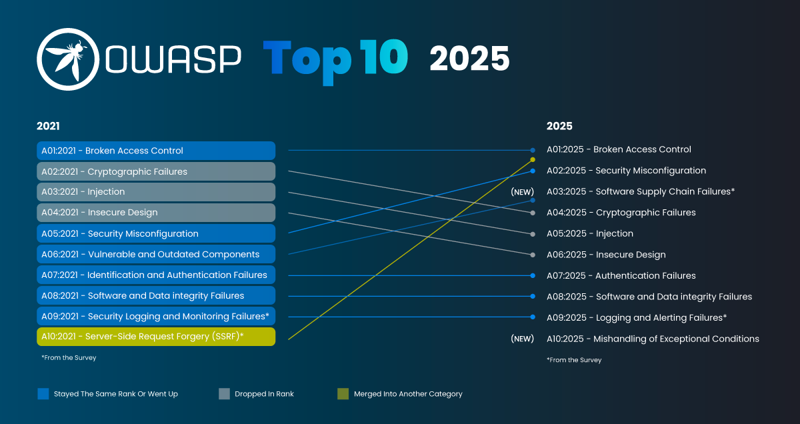
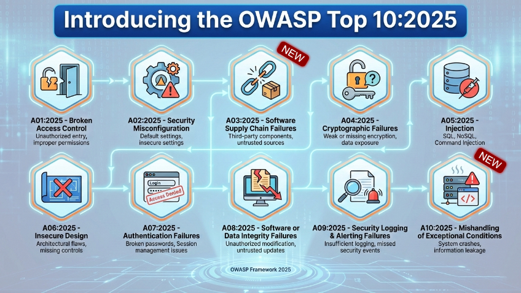

# Introduction to the OWASP Top 10: The Map Every Developer Needs

> A clear breakdown of what the OWASP Top 10 actually is, how the list gets built, what changed in the 2025 edition, and why it functions as a shared vocabulary for application security instead of just a compliance checkbox.

**Series:** Part 1 &nbsp;→&nbsp; **Next up: A01 Broken Access Control**

---

## Table of Contents

1. [Introduction](#introduction-to-the-owasp-top-10-the-map-every-developer-needs)
2. [Why This List Exists](#why-this-list-exists)
3. [How the List Actually Gets Built](#how-the-list-actually-gets-built)
4. [What Changed Recently, and Why It Matters to This Series](#what-changed-recently-and-why-it-matters-to-this-series)
5. [The 2025 List at a Glance](#the-2025-list-at-a-glance)
6. [Why This List Matters Beyond Compliance Checklists](#why-this-list-matters-beyond-compliance-checklists)
7. [Key Takeaways](#key-takeaways)
8. [What's Next](#whats-next)

---

Ask ten developers what the biggest threat to their application is, and you will likely get ten different answers. SQL injection. Weak passwords. A misconfigured S3 bucket someone forgot about six months ago. A dependency nobody has bothered to update since 2022. Every one of those answers is correct, and that is exactly the problem. Application security is not one risk wearing different disguises. It is dozens of distinct failure modes, each with its own root cause, and no single engineer can hold all of them in their head while also shipping features on a deadline.

That is the gap the OWASP Top 10 was built to close. It is a ranked list of the most critical web application security risks, produced by thousands of contributors and security researchers, and it has become the closest thing the industry has to a shared vocabulary for talking about risk. This article opens a series dedicated to walking through that list category by category, in enough depth that you understand *why* each risk exists, not just what to call it when you see it.

## Why This List Exists

The Open Worldwide Application Security Project, better known as OWASP, is a nonprofit foundation that produces free, vendor-neutral resources for improving software security. It runs almost entirely on volunteer contributions from security engineers, developers, and researchers worldwide, and that detail matters more than it might seem. The Top 10 is not a marketing document from a vendor trying to sell you a scanner. It is closer to an industry consensus report, built by the people who actually find these vulnerabilities for a living.

The project exists because most organizations cannot realistically defend against every possible weakness at once. Security budgets are finite. Engineering time is finite. Attention, maybe the scarcest resource of all, is finite. The Top 10 gives teams a prioritized starting point: fix these categories first, because the data says they cause the most damage across the largest number of applications.

The first version of the list was published in 2003, and OWASP has revised it roughly every three to four years since, reflecting how the threat landscape actually shifts rather than how people assume it shifts. That distinction is worth sitting with for a moment. A list built purely on gut feeling tends to overweight whatever made headlines most recently. OWASP instead builds the list from two very different sources, combined deliberately.

## How the List Actually Gets Built

The first source is contributed testing data. Security vendors, consultancies, and bug bounty platforms donate anonymized results from real application security testing, covering millions of applications in production. OWASP analyzes which weakness categories appear most often, how exploitable they tend to be, and how severe the consequences are when someone actually exploits them. The most recent edition drew on testing data from over 2.8 million applications and roughly 175,000 CVE records, each mapped against the Common Weakness Enumeration (CWE) system that MITRE maintains as the standardized catalog for describing software flaws.

The second source is a community survey, and it exists to correct a specific blind spot in the first one. Testing data is inherently backward-looking. It takes time for a new class of vulnerability to be properly understood, for tooling to catch up to it, and for that tooling to run against a large enough population of applications to show up statistically. By the time a risk is well represented in the data, it may already be several years old. To close that gap, OWASP asks practitioners on the front lines what they are seeing right now that the data has not caught up to yet, and lets the highest-voted concerns earn a spot on the list even without strong statistical backing.

| Source | What It Captures | Limitation |
|---|---|---|
| Contributed testing data | Weakness prevalence across 2.8M+ tested applications | Inherently backward-looking |
| Community survey | Emerging risks practitioners see but data hasn't caught up to yet | Not statistically validated |

Most categories in any given edition come from the data. A smaller number come from the survey. The result is a list OWASP describes as data-informed rather than purely data-driven, and they are refreshingly upfront about that tradeoff. It is a deliberate compromise between statistical rigor and staying relevant to what is actually happening on the ground.

*Diagram comparing the OWASP Top 10 2021 and 2025 rankings.*

## What Changed Recently, and Why It Matters to This Series

If you have encountered an older version of the OWASP Top 10 elsewhere, in a course, a certification prep guide, or another blog, it was almost certainly the 2021 edition. That version served as the industry standard for four years. In late 2025, OWASP announced the next full revision, and the finalized version became publicly available in January 2026. This series is built on that current edition, so a few structural changes are worth understanding before we go any further, because they explain naming choices you will see throughout the rest of this series.

**Server-Side Request Forgery**, which stood alone as its own category in 2021, has now been absorbed into Broken Access Control. The reasoning holds up under scrutiny: SSRF is fundamentally a case of an application making a request it should never have been allowed to make in the first place, which is an access control failure at its root, regardless of how the exploitation technique looks on the surface.

**Vulnerable and Outdated Components** has been expanded and renamed to **Software Supply Chain Failures**, broadening its scope beyond outdated libraries sitting in a manifest file to cover compromises anywhere across the dependency chain, build systems, and distribution infrastructure. This shift reflects just how much modern applications depend on code, containers, and infrastructure that nobody on the team actually wrote.

A brand new category, **Mishandling of Exceptional Conditions**, has been added to capture risks stemming from applications that fail to gracefully handle errors, edge cases, or unexpected system states.

Perhaps most strikingly, **Security Misconfiguration** climbed from fifth place in 2021 all the way to second place in 2025. That jump reflects how much modern application behavior is now driven by configuration rather than code: cloud settings, container defaults, feature flags, and infrastructure defined as code, each one a new surface where a single wrong setting can expose an entire system.

None of this means the 2021 categories quietly disappeared. Almost every risk from that edition still exists in the 2025 list, sometimes renamed, sometimes merged into a broader category, sometimes reordered based on updated data. What has actually changed is emphasis, and that emphasis tracks where real damage is happening in production systems right now, not four years ago.

## The 2025 List at a Glance

Here is the complete current list. Each entry below will get its own dedicated, in-depth article later in this series, so treat this section as a preview map rather than the destination itself.

| Rank | Category | What It Covers |
|---|---|---|
| A01 | **Broken Access Control** | The single most common weakness category in the dataset, now carrying SSRF along with it. Failure to properly enforce what an authenticated, or even unauthenticated, user is allowed to do or see. |
| A02 | **Security Misconfiguration** | Default credentials left in production, unnecessary features left enabled, permissive cloud storage settings, missing security headers. Small oversights that compound into major exposure. |
| A03 | **Software Supply Chain Failures** | Compromises anywhere along the chain of dependencies, build tooling, and distribution infrastructure, not just an outdated package in a lockfile. |
| A04 | **Cryptographic Failures** | Sensitive data exposed because it was never encrypted, was encrypted with a broken algorithm, or was protected with poorly managed keys. |
| A05 | **Injection** | The umbrella covering SQL injection, cross-site scripting, command injection, and any case where untrusted input is interpreted as code instead of data. |
| A06 | **Insecure Design** | Risks that exist because of missing or ineffective security controls baked into the architecture before implementation even starts. |
| A07 | **Authentication Failures** | Weaknesses in verifying user identity: credential stuffing, session handling mistakes, weak password policies. |
| A08 | **Software or Data Integrity Failures** | Failure to verify code, updates, and data haven't been tampered with, at a more granular level than supply chain failures. |
| A09 | **Security Logging and Alerting Failures** | Not just insufficient logging, but logs that are generated and never acted on. |
| A10 | **Mishandling of Exceptional Conditions** | New for 2025. Improper error handling, logic errors, and systems that fail open instead of fail closed. |

*Overview graphic of the ten OWASP Top 10:2025 categories from A01 Broken Access Control through A10 Mishandling of Exceptional Conditions.*

It is also worth knowing that three additional risks came close to making the final cut but did not quite get there. OWASP documents them separately as "next steps" categories: a renamed version of Denial of Service now focused on application resilience, memory management failures common in languages like C and C++, and a genuinely new entry addressing the risks of trusting AI-generated code without adequate review. That last one is becoming harder to ignore with each passing year, and later articles in this series will reference it where relevant, particularly as more development workflows come to rely on AI assistance by default.

## Why This List Matters Beyond Compliance Checklists

It is easy to treat the OWASP Top 10 as a box-checking exercise, something a compliance team dusts off once a year before an audit and then forgets about. That framing sells the list short.

For developers, it functions as a shared language. When a code reviewer flags something as "an A05 issue," everyone on the team who is familiar with the list understands roughly what category of problem is being described, without needing a paragraph of explanation attached to the comment.

For organizations, it works as a prioritization tool. Given limited time and an even more limited budget, fixing the categories most likely to cause serious harm produces a far better return than chasing whatever bug happened to get reported most recently and loudly.

For learners and aspiring penetration testers, it doubles as a curriculum. Nearly every entry-level security certification, every beginner-friendly training platform, and every capture-the-flag exercise eventually maps back to these categories in some form, precisely because they represent where real vulnerabilities concentrate in real applications.

None of that makes the Top 10 a complete security program on its own, and OWASP is explicit about this point. It represents the ten most critical risks, not the only ten risks that exist. Treat it as a floor to build on, not a ceiling to stop at.

## Key Takeaways

- The OWASP Top 10 is a ranked list of the most critical web application security risks, built from contributed testing data spanning millions of applications and combined with a practitioner survey designed to catch emerging risks before the data catches up to them.
- The current edition is the 2025 revision, finalized in January 2026, which replaced the 2021 edition that had served as the reference point for the previous four years.
- The most notable structural changes in 2025 include SSRF being folded into Broken Access Control, Vulnerable and Outdated Components expanding into the broader Software Supply Chain Failures category, and a new Mishandling of Exceptional Conditions category rounding out the list at A10.
- Above all, the list is best understood as a prioritization tool and a shared vocabulary for the industry, not a complete security program you can implement and then consider the job finished.

## What's Next

The next article in this series goes deep on **A01: Broken Access Control**, the category that has held the top spot across multiple revisions of the list and now carries SSRF along with it. We will unpack what access control actually means at the application layer, the most common ways it breaks down in real codebases, and what genuinely effective prevention looks like beyond the generic advice to "just check permissions."

Shortly after that, the first PortSwigger Web Security Academy write-up in this publication will walk through a lab that demonstrates one of these access control failures hands-on, connecting the theory covered in this series to a working, exploitable example inside a safe training environment. If you have been reading this series to understand the concepts, that next pairing of articles is where the concepts start to feel real.

---

*Originally published on [Medium](https://medium.com/@madebyabder/introduction-to-the-owasp-top-10-the-map-every-developer-needs-5dbdbaad3ef5). Cross-posted here as part of my cybersecurity portfolio.*
