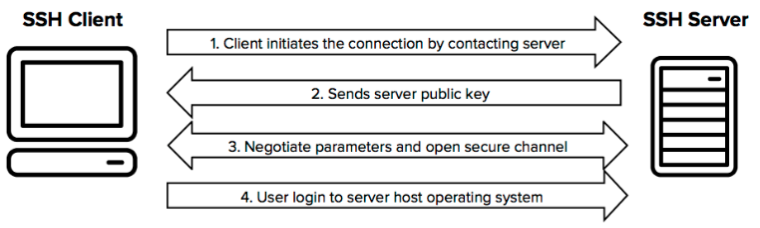
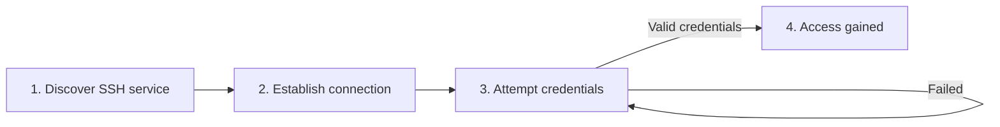
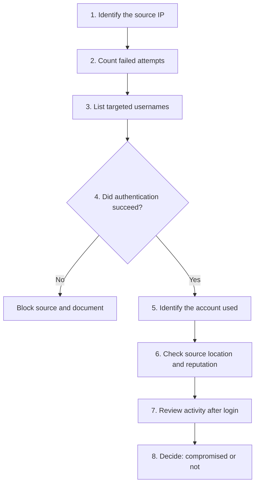

# What Actually Happens During an SSH Brute-Force Attack?

<p align="center">
  
  <br>
  <em>Figure 1: A simplified view of an SSH connection, from TCP handshake to authenticated session.</em>
</p>


SSH is the standard way administrators reach Linux servers remotely. It is also one of the first services an attacker probes when a machine is exposed to the Internet. Leave a server on a public IP address for a few hours and its authentication log will usually show why.

The idea behind a brute-force attack is simple: try credentials until one works. What is more interesting is what that looks like on the wire, in the logs, and on a defender's screen.

This article follows an attack from the first connection to the authentication log, then covers detection and defense.

---

## Table of Contents

1. [What Is SSH?](#1-what-is-ssh)
2. [What Is an SSH Brute-Force Attack?](#2-what-is-an-ssh-brute-force-attack)
3. [Anatomy of the Attack](#3-anatomy-of-the-attack)
4. [What the Attack Looks Like in Logs](#4-what-the-attack-looks-like-in-logs)
5. [When Brute Force Becomes Dangerous](#5-when-brute-force-becomes-dangerous)
6. [Detection](#6-detection)
7. [Defense](#7-defense)
8. [Investigating an Alert as a SOC Analyst](#8-investigating-an-alert-as-a-soc-analyst)
9. [The Bigger Lesson](#9-the-bigger-lesson)
10. [Conclusion](#conclusion)
11. [References](#references)

---

## 1. What Is SSH?

**SSH (Secure Shell)** is a cryptographic network protocol used to access and manage remote systems over an untrusted network. It encrypts the session, so credentials and commands are not readable in transit.

A typical connection follows this sequence:

```text
SSH Client                           SSH Server
    |                                    |
    | ------- TCP connection ----------> |
    |                                    |
    | <------ SSH negotiation ---------- |
    |                                    |
    | ------- Authentication ----------> |
    |                                    |
    | <------- Access granted ---------- |
```

SSH listens on **TCP port 22** by default, although administrators can move it to another port. After authentication, the user can do whatever their account permissions allow.

That makes the authentication step the gate to the whole system, and the reason it attracts so much attacker attention.

---

## 2. What Is an SSH Brute-Force Attack?

A brute-force attack tries to gain access by repeatedly submitting credentials. The attacker does not know in advance which ones are valid, so they test possibilities:

```text
admin  : password123
admin  : admin123
admin  : qwerty
root   : password
root   : 123456
...
```

Real attacks are automated and work through very large lists of usernames and passwords at high speed.

The term "brute force" is often used loosely. There are four related techniques, and they behave differently in logs:

| Technique | How it works | MITRE ATT&CK |
|---|---|---|
| **Brute force** | Systematically tries many password combinations against an account | T1110.001 |
| **Dictionary attack** | Tries passwords from a prepared wordlist | T1110.001 |
| **Password spraying** | Tries one or a few common passwords against many accounts, which avoids per-account lockouts | T1110.003 |
| **Credential stuffing** | Replays username and password pairs leaked in earlier breaches | T1110.004 |

Knowing which one you are looking at changes how you investigate. Spraying, for example, shows up as one failure per user across many users, not as many failures against one user.

---

## 3. Anatomy of the Attack

An SSH brute-force attack has four stages.



### Stage 1: Finding an SSH service

Before guessing anything, the attacker needs a target. A scan reveals exposed services:

```text
PORT   STATE SERVICE
22/tcp open  ssh
```

An open port does not mean the system is compromised. It means a service is reachable and answering. Exposure widens the attack surface, though, particularly when the service faces the public Internet.

> **An exposed service is not a compromised service, but it is the precondition for every attack that follows.**

### Stage 2: Establishing the connection

The attacker connects, and the client and server negotiate the parameters of an encrypted session. Only after that does authentication begin.

This matters because brute force is sometimes pictured as passwords thrown directly at port 22. In reality, each attempt happens inside a negotiated SSH session, which is also one reason the attack is slower than people expect.

### Stage 3: Repeated authentication attempts

The attacker then submits credentials, one pair after another:

```text
                  SSH Server
                      |
        +-------------+-------------+
        |             |             |
    Attempt 1     Attempt 2     Attempt 3   ...   Attempt N
        |             |             |                 |
     Failed        Failed        Failed          Success or failure
```

Each wrong guess is rejected and the attacker moves on. Automated tools make this orders of magnitude faster than manual typing.

### Stage 4: Access

If a guess succeeds, the attacker holds a valid session. At that point the event is no longer an authentication attack but an intrusion.

---

## 4. What the Attack Looks Like in Logs

Logs are where this attack becomes visible to defenders. On Debian and Ubuntu, `sshd` writes authentication events to `/var/log/auth.log`. On RHEL-based systems the file is `/var/log/secure`. Systems using systemd can also query them with `journalctl -u ssh`.

A burst of automated guessing looks like this:

```text
Oct  3 02:14:07 srv01 sshd[1842]: Failed password for invalid user admin from 203.0.113.50 port 51234 ssh2
Oct  3 02:14:09 srv01 sshd[1844]: Failed password for invalid user admin from 203.0.113.50 port 51236 ssh2
Oct  3 02:14:11 srv01 sshd[1846]: Failed password for root from 203.0.113.50 port 51238 ssh2
Oct  3 02:14:13 srv01 sshd[1848]: Failed password for root from 203.0.113.50 port 51240 ssh2
Oct  3 02:14:15 srv01 sshd[1850]: Failed password for invalid user test from 203.0.113.50 port 51242 ssh2
```

Three details are worth reading closely:

- **`invalid user`** means the username does not exist on the system. Many of these in a row suggest the attacker is guessing account names blindly.
- **The source IP** stays constant here, which points to a single scanning host. A distributed attack would show many sources.
- **The source port** changes with each attempt, because each attempt opens a new TCP connection.

One failed login means nothing. A person mistypes a password every day. Hundreds of failures against several usernames from one source in a few minutes are a different situation.

---

## 5. When Brute Force Becomes Dangerous

Most brute-force attempts fail. The danger starts when one succeeds:

```text
Oct  3 02:41:52 srv01 sshd[2310]: Accepted password for admin from 203.0.113.50 port 52980 ssh2
```

```text
Attacker
   |
   |  username: admin
   |  password: ********
   v
SSH Server
   |
   |  Authentication successful
   v
Remote Shell
```

The attacker now has an initial foothold. What happens next depends on the privileges of the compromised account and the controls around it:

- Privilege escalation
- Persistence
- Credential harvesting
- Lateral movement
- Data theft
- Command execution

This is why SSH brute force is best understood as an **initial-access technique** and not as a complete attack. It is the first step in a longer chain.

---

## 6. Detection

Detection starts with monitoring authentication failures. Four indicators are especially useful.

**High failure volume.** A large number of failed logins in a short window points to automated guessing.

**Many usernames from one source.** Common account names tried in sequence suggest enumeration:

```text
root, admin, test, ubuntu, guest, administrator
```

**Slow, persistent activity.** Some campaigns deliberately space out attempts to stay below simple thresholds. Look at behavior over hours and days, not only minutes.

**Success after many failures.** This is the highest-priority pattern:

```text
Failed
Failed
Failed
Failed
SUCCESS
```

A successful login following a long run of failures, especially from an unusual source or onto an unusual account, should always be investigated.

### A quick triage command

To see which source IPs generate the most failures on a Debian or Ubuntu host:

```bash
grep "Failed password" /var/log/auth.log \
  | grep -oE "from [0-9]{1,3}(\.[0-9]{1,3}){3}" \
  | sort | uniq -c | sort -rn | head
```

In a production environment this kind of check belongs in a SIEM such as Wazuh, with rules and thresholds, not in manual `grep` sessions. The command is useful for understanding what the data looks like before you automate the detection.

---

## 7. Defense

No single setting solves this problem. Layered controls are much stronger than any one of them.

| Control | Why it helps |
|---|---|
| **Use SSH keys instead of passwords** | Public-key authentication removes password guessing as an attack path |
| **Disable password authentication** | Where keys are available, turning passwords off eliminates a whole class of attack |
| **Disable direct root login** | Forces attackers to guess both a valid username and a password, and keeps administrative actions tied to named accounts |
| **Restrict SSH exposure** | Limit access to a VPN, bastion host, or specific administrative IP ranges instead of the whole Internet |
| **Rate limit and block** | Tools such as Fail2ban temporarily ban sources that keep failing |
| **Monitor authentication logs** | Even a well-configured server needs someone, or something, watching it |

### Example hardening baseline

The relevant directives in `/etc/ssh/sshd_config` look like this:

```text
PermitRootLogin no
PasswordAuthentication no
PubkeyAuthentication yes
MaxAuthTries 3
LoginGraceTime 30
AllowUsers deploy admin
```

After any change, validate the configuration and reload the service:

```bash
sudo sshd -t && sudo systemctl reload ssh
```

> **Caution:** Before disabling password authentication, confirm that your key-based login works in a second session. Otherwise you can lock yourself out of the server.

Changing the default port reduces noise from opportunistic scanners, but it is not a security control on its own. Treat it as a minor convenience, not a defense.

---

## 8. Investigating an Alert as a SOC Analyst

Suppose you receive an alert for unusual SSH activity. A structured investigation follows these steps:



At this point the attack stops being a simple hacking technique and becomes a **detection and investigation problem**. The analyst is not only asking:

> "Did someone try to log in?"

The real questions are:

> "Was the activity malicious, did it succeed, and what happened afterward?"

If the answer to the second question is yes, the priorities change quickly: contain the account, preserve the logs, and review everything the session did.

---

## 9. The Bigger Lesson

An attack does not need to be sophisticated to be dangerous.

SSH is well designed and encrypted. Weak credentials, unnecessary exposure, poor monitoring, or loose access controls can still hand an attacker a way in. Security cannot rest on one control. It rests on several, stacked so that a failure in one is caught by another:

```text
Strong authentication
         +
Limited exposure
         +
Least privilege
         +
Rate limiting
         +
Logging
         +
Monitoring
         +
Incident response
```

If one layer fails, the others should make exploitation harder and help you work out what happened.

---

## Conclusion

An SSH brute-force attack is a repeated authentication attack against a remote service. The mechanics are short:

**Discover SSH, connect, attempt credentials, observe responses, repeat, gain access if successful.**

The more valuable skills sit around that process. Can you recognize the attack in logs? Can you separate ordinary failed logins from automated activity? Can you tell whether an attempt succeeded? And if it did, can you reconstruct what happened next?

Answering those questions is what moves you from knowing what a brute-force attack is to thinking like a security analyst.

---

## References

- Red Hat, *How to secure the SSHD daemon*
- OpenSSH documentation, `sshd_config` manual
- MITRE ATT&CK, [T1110 Brute Force](https://attack.mitre.org/techniques/T1110/)
- MITRE ATT&CK, [T1078 Valid Accounts](https://attack.mitre.org/techniques/T1078/)
- MITRE ATT&CK, [T1021.004 Remote Services: SSH](https://attack.mitre.org/techniques/T1021/004/)

---

<p align="center">
  <em>This article is intended for educational and defensive cybersecurity purposes. Test only on systems you own or are explicitly authorized to assess.</em>
</p>
