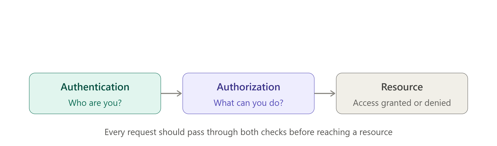

# A01: Broken Access Control, Understanding the Most Critical Web Security Risk

> A deep dive into the OWASP Top 10's #1 risk: what access control actually means, why it fails so often, the most common real-world patterns (IDOR, privilege escalation, forced browsing), and how to prevent it at the server level.

**Series:** Part 2 &nbsp;→&nbsp; **Previous: [Introduction to the OWASP Top 10](https://github.com/madebyabder/cybersecurity-blog/blob/main/blogs/Introduction-to-the-OWASP-Top-10/index.md)**

---

## Table of Contents

1. [Introduction](#a01-broken-access-control-understanding-the-most-critical-web-security-risk)
2. [What Is Access Control?](#what-is-access-control)
3. [What Is Broken Access Control?](#what-is-broken-access-control)
4. [Common Types of Broken Access Control](#common-types-of-broken-access-control)
5. [Real-World Examples](#real-world-examples)
6. [Business Impact](#business-impact)
7. [Prevention](#prevention)
8. [Key Takeaways](#key-takeaways)
9. [What's Next](#whats-next)

---

If you read the introduction to this series, you already know that the OWASP Top 10:2025 opens with Broken Access Control, and that this is not a new development. Access control has held the number one spot for years, and the 2025 edition made its dominance even clearer. According to OWASP's own testing data, every single application in the dataset used to build this edition showed some form of broken access control. Not most applications. Not the majority. All of them.

That statistic is worth sitting with, because it tells you something important: this is not a rare mistake made by careless teams. It is a structural risk baked into how web applications are built, and it shows up in codebases written by experienced engineers just as often as in beginner projects.

Most of the highest-profile breaches you have read about did not involve exotic exploitation techniques. They involved someone changing a number in a URL, sending a request to an endpoint that should have checked their permissions and did not, or discovering that an admin panel was reachable simply by typing the right path. Access control failures are unglamorous, which is part of why they are so dangerous. They rarely require custom tooling or deep technical sophistication. They require noticing that a check is missing.

## What Is Access Control?

Before we can talk about how access control breaks, it helps to be precise about what it actually is, because the term gets used loosely and that looseness causes real confusion in engineering teams.

### Authentication vs Authorization

These two words get used almost interchangeably in casual conversation, but they answer completely different questions, and mixing them up is one of the root causes of access control failures.

**Authentication** answers the question "who are you?" It is the process of verifying identity: a password, a fingerprint, a one-time code sent to your phone, a session token. Once authentication succeeds, the application knows who is making a request.

**Authorization** answers a different question entirely: "what are you allowed to do?" Knowing who someone is does not automatically tell an application what that person should be permitted to see or change. A logged-in user is authenticated, but that says nothing about whether they should be able to view another customer's invoice, delete a colleague's account, or reach an internal admin dashboard.

This distinction matters because a huge number of broken access control vulnerabilities come from developers implicitly treating authentication as if it were authorization. The reasoning, often unstated, goes something like: "this user is logged in, so they must be allowed to be here." That assumption is exactly where the vulnerability lives.

### Principle of Least Privilege

The principle of least privilege is a simple idea with an outsized impact on security posture: every user, process, and system component should have access to only the resources and actions it strictly needs, and nothing more. A customer support representative does not need the ability to modify billing records. A reporting service that only reads data does not need write access to the database.

When least privilege is followed consistently, a single compromised account or exploited bug has a limited blast radius. When it is ignored, and accounts are given broad access "just in case it's needed later," a single failure can cascade into full system compromise.

### Role-Based Access Control (RBAC)

Role-Based Access Control is the most common model used to implement authorization in practice. Instead of assigning permissions to individual users one by one, permissions are grouped into roles (administrator, editor, viewer, billing manager), and users are assigned to one or more of those roles. When someone's job changes, you change their role assignment rather than manually rewriting a list of permissions.

RBAC is popular because it scales well and matches how most organizations already think about responsibility. Its main weakness is rigidity: real-world permission needs are often more nuanced than a fixed set of roles can express cleanly, which sometimes pushes teams toward overly broad roles just to avoid creating dozens of narrow ones.

### Attribute-Based Access Control (ABAC)

Attribute-Based Access Control takes a more flexible approach. Instead of relying purely on a role, ABAC evaluates a combination of attributes at the moment access is requested: who the user is, what resource they are trying to access, what relationship they have to that resource, and sometimes contextual factors like time of day or location. A support agent might be allowed to view tickets only for customers in their assigned region, for instance, which is difficult to express cleanly with RBAC alone.

ABAC is more powerful and more precise, but that power comes with added complexity in both design and maintenance. Many modern applications end up using a hybrid: RBAC for broad structural permissions, with ABAC-style ownership and context checks layered on top for anything involving individual records.

  
   
  <em>Every request should pass through both an authentication check and an authorization check before reaching a resource.</em>

## What Is Broken Access Control?

With those definitions in place, the vulnerability itself is straightforward to describe: broken access control occurs when an application fails to properly enforce restrictions on what an authenticated, or even unauthenticated, user is allowed to do.

That failure can take many concrete forms, but they all trace back to the same root cause: somewhere in the system, a check that should have happened either did not happen at all, was implemented incorrectly, or was enforced in the wrong place.

That last point deserves emphasis. A significant share of access control failures come from checks that exist, but exist only in the user interface. A button is hidden from regular users so they cannot see an admin action, but the underlying API endpoint that performs that action still accepts requests from anyone who knows the URL and sends the right request directly. The interface enforces the rule; the server does not. This is why access control has to be enforced server-side, every time, for every request, regardless of what the interface shows or hides.

Broken access control is also notoriously difficult to detect using automated tools. A SQL injection vulnerability tends to produce a distinctive error message or behavior change that a scanner can recognize. A missing authorization check often produces a perfectly normal-looking response, just one that happens to contain data or perform an action the requester should not have been allowed to reach. The application does not crash. It does not throw an unusual error. It simply does exactly what was asked, without checking whether it should have. That is precisely why access control testing tends to require a human thinking through the application's logic, not just an automated scan.

## Common Types of Broken Access Control

**Insecure Direct Object References (IDOR).** This occurs when an application uses an identifier supplied by the user, such as an account number or record ID in a URL, to look up a resource, without verifying that the requester actually owns or is entitled to that resource. If changing `invoice_id=1042` to `invoice_id=1043` in a browser's address bar shows you someone else's invoice, that is IDOR. It is widely considered the single most common form of broken access control, precisely because it requires no special tooling to discover, just curiosity and a willingness to edit a number.

**Forced Browsing.** This happens when a user reaches a page or endpoint that was never meant to be accessible to them, simply by requesting a URL directly rather than navigating through the application's intended flow. If an admin dashboard sits at a predictable path and nothing checks who is requesting it, forced browsing is all it takes to reach it.

**Missing Authorization Checks.** Sometimes the failure is simpler than any named technique: a code path was written to check that a user is logged in, but the developer never added a second check confirming that the logged-in user is allowed to perform that specific action on that specific resource.

**Privilege Escalation.** This describes any situation where a user gains access to permissions beyond what they were assigned. It comes in two flavors. Vertical escalation is when a regular user gains administrator-level capabilities. Horizontal escalation is when a user gains access to another user's data or actions at the same privilege level, which is effectively what IDOR produces.

**Parameter Tampering.** Closely related to IDOR, this is the broader practice of modifying request parameters, whether in a URL, a hidden form field, or a request body, to manipulate what the server does. A price field, a role field, or a discount flag sent from the client and trusted without server-side validation is a parameter tampering risk waiting to be discovered.

**File Permission Issues.** Access control does not stop at the application layer. Misconfigured file or object storage permissions, an overly permissive cloud storage bucket, a server directory that should not be browsable, can expose files to anyone who finds the right path, independent of anything the application code does.

**API Authorization Failures.** Modern applications lean heavily on APIs, and APIs are frequently where access control breaks down hardest, because there is no visible interface hiding the dangerous options from a casual user. An API that exposes POST, PUT, or DELETE operations without checking whether the caller is authorized for that specific action is a direct, unfiltered path to an access control failure, particularly since API clients rarely include the visual cues a web interface would.

## Real-World Examples

These patterns are not theoretical. They show up constantly in real applications, and the scenarios tend to be almost boringly simple once you understand the underlying category.

Consider a billing dashboard where invoices are retrieved through a URL like `/invoices/view?id=4521`. A customer, out of curiosity or by accident, changes the number and finds themselves looking at someone else's invoice, complete with billing address and payment history. Nothing was hacked in any technical sense. The server simply never checked whether the logged-in user actually owned invoice 4521.

Consider an admin panel that was never linked anywhere in the visible application, on the assumption that if nobody can see a link to it, nobody will find it. That assumption, sometimes called security through obscurity, collapses the moment someone guesses or discovers the path, because there was never an actual authorization check standing between an ordinary user and administrative functionality.

Consider a file-sharing feature where documents are stored with predictable, sequential filenames. A customer downloading their own file notices the naming pattern, adjusts the filename slightly, and downloads a file that belongs to a different customer entirely. Again, nothing exotic. Just a missing ownership check where one was assumed to be unnecessary.

None of these examples require deep technical skill to exploit. That is exactly the point, and exactly why this category causes so much real-world damage.

## Business Impact

The consequences of broken access control extend well past a single embarrassing bug report, and they touch every dimension of the CIA triad that security teams care about.

**Confidentiality** takes the most direct hit. When access control fails, data that should have been restricted to specific users becomes visible to anyone who knows how to ask for it, whether that is a competitor, a curious customer, or an actual attacker.

**Integrity** is at risk whenever the broken control governs a write action rather than a read. Being able to modify someone else's data, change prices, or alter records you were never meant to touch is often more damaging than simply viewing something you shouldn't.

**Availability** can also suffer, particularly when privilege escalation grants an attacker administrative capabilities that let them disable accounts, delete records, or take services offline.

Beyond the technical triad, the business consequences compound quickly. A data breach traced back to a missing authorization check invites regulatory scrutiny, and depending on the jurisdiction and the type of data exposed, can trigger significant financial penalties under frameworks like GDPR or sector-specific regulations. Account compromise stemming from privilege escalation can lead to fraud, unauthorized transactions, or further intrusion into connected systems. And because access control failures are so easy to explain to a non-technical audience (changing a number in a URL requires no jargon to describe), they tend to generate outsized reputational damage and erode customer trust in a way that more abstract vulnerabilities sometimes do not.

## Prevention

The good news is that preventing broken access control does not require exotic tooling. It requires discipline applied consistently.

**Enforce authorization on the server, every time.** Client-side checks, hidden buttons, disabled menu items, are a usability feature, not a security control. Every request that touches sensitive data or performs a sensitive action needs a server-side check confirming the requester is actually allowed to do what they are asking to do.

**Deny by default.** Access should be denied unless explicitly granted, not granted unless explicitly denied. This single default flips the risk calculus in your favor: a missing rule results in an access denial rather than an unintended exposure.

**Apply the principle of least privilege consistently.** Give users, services, and roles only the access they need for their actual responsibilities, and revisit those grants periodically rather than letting them accumulate indefinitely.

**Never trust client-side controls for security decisions.** Anything sent from the browser, whether a hidden field, a role parameter, or a price value, should be treated as untrusted input and revalidated against server-side records, not taken at face value.

**Use centralized authorization logic rather than scattering checks throughout the codebase.** When every endpoint implements its own ad hoc permission check, it becomes almost inevitable that some endpoint gets missed. A centralized authorization layer or middleware makes the rule consistent and makes it far harder to accidentally ship a route with no check at all.

**Test authorization logic regularly, and test it deliberately.** Because access control failures often produce normal-looking responses rather than obvious errors, they need dedicated test cases that specifically attempt to access resources as the wrong user, not just tests confirming that the right user can reach their own data. Treat authorization as a first-class part of your test suite, not an afterthought.

## Key Takeaways

- Broken access control has held the top spot in the OWASP Top 10 for a reason grounded in data, not tradition. Every application tested for the 2025 edition showed some form of it, making it the closest thing to a universal risk in modern web development.
- Authentication and authorization are different questions. Knowing who a user is does not tell you what they should be allowed to do, and conflating the two is where a large share of these vulnerabilities originate.
- The most common real-world variant, IDOR, requires nothing more sophisticated than changing an identifier in a request, which is exactly why it appears so frequently and why it is so easy to underestimate.
- Prevention comes down to a consistent discipline: enforce checks server-side, deny by default, apply least privilege, and never assume a hidden button is a security control.

## What's Next

The next article in this series moves to **A02: Security Misconfiguration**, the category that made the biggest jump in the 2025 edition, climbing from fifth place to second. We will look at why so much of modern application risk now comes from configuration rather than code, and what that means for teams managing cloud infrastructure, containers, and increasingly complex deployment pipelines.

Before we get there, though, this publication is taking a short detour. The next piece will be a PortSwigger Web Security Academy lab write-up demonstrating Broken Access Control hands-on, in a safe training environment, connecting everything covered in this article to a working, exploitable example you can reason through yourself.

---

*Originally published on [Medium](https://medium.com/@madebyabder/a01-broken-access-control-understanding-the-most-critical-web-security-risk-ba8c44c97845?sharedUserId=madebyabder). Cross-posted here as part of my cybersecurity portfolio.*
