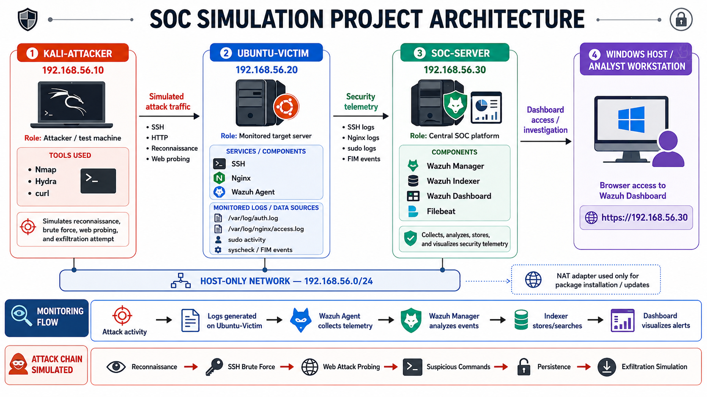

# Building a SOC From Scratch: Detecting Reconnaissance and SSH Brute-Force with Wazuh (Part 1)


> A hands-on walkthrough of building a three-machine Wazuh SOC lab and using it to detect Nmap reconnaissance and SSH brute-force attacks through real log analysis, MITRE ATT&CK mapping, and analyst-style investigation.

**Series:** Part 1 of 2 — Part 2 covers web application attacks, suspicious command execution, persistence, simulated data exfiltration, and full attack-chain correlation.

---

## Table of Contents

1. [Introduction](#introduction)
2. [Background](#background)
3. [Core Concept](#core-concept)
4. [Lab Architecture](#lab-architecture)
5. [Preparing the Victim](#preparing-the-victim)
6. [Validating Telemetry](#validating-telemetry)
7. [Practical Example](#practical-example)
   - [Detecting Reconnaissance](#detecting-reconnaissance)
   - [Detecting SSH Brute-Force](#detecting-ssh-brute-force)
8. [Thinking Like a SOC Analyst](#thinking-like-a-soc-analyst)
9. [Considering False Positives](#considering-false-positives)
10. [Best Practices / Mitigation](#best-practices--mitigation)
11. [Key Takeaways](#key-takeaways)
12. [Conclusion](#conclusion)
13. [References](#references)

---

## Introduction

Installing a SIEM is only the first step. The real value comes from understanding the telemetry it collects, recognizing malicious behavior, and investigating alerts the way a SOC analyst would.

To practice those skills, I built a small Security Operations Center (SOC) lab using **Wazuh** inside an isolated virtual environment. Rather than simply deploying the platform, I simulated a realistic attack chain and analyzed how each stage appeared inside the SIEM.

This project covers:

- Building the lab architecture
- Preparing the monitored Linux server
- Validating telemetry collection
- Detecting reconnaissance using Nmap
- Detecting SSH brute-force attempts using Hydra
- Evaluating alert severity and possible false positives

## Background

Reading about SIEM platforms and detection rules is useful, but actually seeing your own attack traffic become alerts teaches much more.

The objective wasn't simply to install Wazuh — it was to understand the complete detection workflow: generate realistic attacker activity, verify telemetry reaches the SIEM, investigate the resulting alerts, map detections to MITRE ATT&CK, assess alert severity, and document the investigation the way a SOC analyst would.

Wazuh is a good fit for this because it's free and open-source, and it exposes the pieces that actually matter for learning: raw log collection, a rule engine, MITRE ATT&CK mapping, and File Integrity Monitoring (FIM).

## Core Concept

### Lab Architecture

The environment consists of three virtual machines connected through a **VirtualBox Host-Only network**. This configuration isolates every attack from the public internet while allowing communication between the attacker, the monitored endpoint, and the SOC server.

<!-- 📸 Screenshot: network diagram / VirtualBox host-only network settings -->


| Role | OS | IP Address |
|---|---|---|
| Attacker | Kali Linux | `192.168.56.10` |
| Monitored Endpoint | Ubuntu Server | `192.168.56.20` |
| SIEM / SOC Server | Wazuh Server | `192.168.56.30` |

Using a Host-Only network keeps every simulated attack contained to machines I own, and it forces the same kind of network segmentation thinking you'd apply in a real environment, where a monitored segment shouldn't have arbitrary internet access.

### Preparing the Victim

Ubuntu Server was configured to run two services that generate useful security logs: OpenSSH and Nginx.

```bash
sudo apt update
sudo apt install openssh-server nginx curl net-tools -y
sudo systemctl enable ssh --now
sudo systemctl enable nginx --now
```

The two log sources that matter for this whole project:

- `/var/log/auth.log` — SSH logins, failures, invalid users, sudo activity
- `/var/log/nginx/access.log` — every HTTP request hitting the box

### Validating Telemetry

Before launching any attacks, I confirmed that logs generated on Ubuntu were actually reaching Wazuh. To verify the pipeline, I generated three simple events: a successful SSH login, a failed SSH login, and a sudo command execution.

Each event appeared inside the Wazuh Dashboard with useful investigation fields, including `agent.name`, `agent.ip`, `data.srcip`, `data.srcuser`, `rule.description`, and `rule.level`.

<!-- 📸 Screenshot: Wazuh dashboard showing the three validation events -->


> **Lesson learned:** This step is often skipped in tutorials, but it's essential. If telemetry isn't working correctly, later investigations become unreliable — it becomes impossible to tell whether an attack wasn't detected or whether the logging pipeline simply failed.

## Practical Example

### Detecting Reconnaissance

Reconnaissance is usually the first observable stage of an intrusion. Before attempting exploitation, attackers often identify open ports and running services.

To simulate this, I ran a basic scan and a service-version scan from Kali against the monitored Ubuntu server.

```bash
nmap 192.168.56.20
nmap -sV 192.168.56.20
```

<!-- 📸 Screenshot: basic Nmap scan output -->


<!-- 📸 Screenshot: Nmap service-version scan output -->


Instead of immediately producing SSH-related alerts, the scans generated HTTP requests against the Nginx web server. Inside the access logs, I observed requests to paths such as `/HNAP1` and `/sdk` — common artifacts produced by automated scanning tools.

<!-- 📸 Screenshot: Nginx access log entries showing the scan artifacts -->


Inside Wazuh, I filtered events using:

```
data.srcip: "192.168.56.10"
nginx
```

<!-- 📸 Screenshot: Wazuh source IP filter applied -->


<!-- 📸 Screenshot: resulting Wazuh alert list for the scan -->


**Alert data observed:**

| Field | Value |
|---|---|
| `agent.ip` | `192.168.56.20` |
| `data.srcip` | `192.168.56.10` |
| `data.url` | `/HNAP1`, `/sdk` |
| `rule.description` | Web server 400 error code |
| `rule.level` | 5 |

> **Lesson learned:** Reconnaissance doesn't always appear where you expect. Since the scan interacted primarily with the web server, the most valuable evidence came from Nginx logs rather than SSH logs — no `sshd` events were generated at all. This reinforced why relying on a single log source is risky: a SOC watching only SSH would have missed this scan entirely. Firewall logs, an IDS like Suricata, or network flow data would round out visibility here.

**MITRE ATT&CK techniques observed:**
- `T1595` — Active Scanning
- `T1046` — Network Service Discovery

### Detecting SSH Brute-Force

After validating reconnaissance detection, I simulated an automated SSH password-guessing attack using Hydra. The objective wasn't to compromise the server, but to generate realistic authentication failures for investigation.

```bash
hydra -L users.txt -P passwords.txt ssh://192.168.56.20 -t 2 -V
```

<!-- 📸 Screenshot: Hydra output showing attempted credential pairs -->


Hydra performed 25 authentication attempts. No valid credentials were discovered, which was expected — the focus of this exercise was detection, not compromise.

Ubuntu's authentication log showed failed passwords, invalid users, PAM authentication failures, and SSH disconnect events.

<!-- 📸 Screenshot: relevant lines from /var/log/auth.log -->


Inside Wazuh, I searched for:

```
sshd
data.srcip: "192.168.56.10"
```

<!-- 📸 Screenshot: Wazuh SSH brute-force alerts -->


**Alert data observed:**

| Field | Value |
|---|---|
| `data.srcuser` | `fakeuser`, `test`, `labuser` |
| `rule.description` | sshd: Attempt to login using a non-existent user |
| `rule.description` | syslog: User missed the password more than one time |
| `rule.level` | 5 / 10 |
| `rule.mitre.id` | `T1110` |
| `rule.mitre.technique` | Password Guessing |
| `rule.mitre.tactic` | Credential Access |

## Thinking Like a SOC Analyst

A single failed SSH login rarely indicates malicious activity. What made this event suspicious was the combination of several indicators:

- Multiple authentication failures
- Multiple usernames, including nonexistent ones
- Repeated attempts from the same IP address
- A short time interval between attempts
- Increasing alert severity as attempts repeated

Rather than treating every failed login as an attack, analysts look for patterns that distinguish normal user mistakes from automated password-guessing activity.

Based on those indicators, I classified this event as **Medium-to-High severity** — high enough to warrant investigation because it's clearly automated, but not Critical, since no login actually succeeded. It would escalate to High or Critical if a successful login followed the failures, or if similar activity spread across multiple systems. That escalation logic is explored further in Part 2, once this brute-force attempt gets correlated with everything that follows it.

## Considering False Positives

Before escalating an alert, it's worth ruling out legitimate explanations:

- A user entering the wrong password several times
- An administrator testing multiple accounts
- Automation using outdated credentials
- A service account with an expired password

Correlating multiple indicators — number of usernames, timing, and source IP — is what separates a real brute-force pattern from ordinary noise.

## Best Practices / Mitigation

**Reconnaissance**
- Limit unnecessary exposed services.
- Use host firewalls to log and restrict inbound traffic.
- Deploy a lightweight IDS such as Suricata for additional visibility, since endpoint logs alone may miss reconnaissance that never touches a monitored service.

**SSH Brute-Force**
- Prefer SSH key authentication over passwords.
- Deploy Fail2Ban or a similar rate-limiting control.
- Restrict SSH access to trusted networks where possible.
- Alert on the same correlation signals used above: multiple usernames, one source IP, short time window.

## Key Takeaways

- Always validate your telemetry before testing detections. A missing alert may mean a broken logging pipeline, not an undetected attack.
- Reconnaissance activity may appear in unexpected log sources depending on which service it actually touches.
- A single failed login is noise. Repetition, multiple usernames, a consistent source IP, and a short time window are what turn noise into a credible brute-force indicator.
- Effective SOC analysis depends on context. Individual alerts rarely tell the full story, but correlating multiple observations is what lets an analyst separate genuinely suspicious behavior from false positives.

## Conclusion

Building the environment was only the beginning. The real learning came from validating telemetry, investigating alerts, understanding why Wazuh generated each detection, and documenting the investigation from a defender's perspective.

Reconnaissance and SSH brute-force are relatively simple attack techniques, but they already cover many of the core skills expected from a SOC analyst: log analysis, alert triage, MITRE ATT&CK mapping, severity assessment, and structured investigation.

**Part 2** continues the attack chain with web application attacks, suspicious command execution, persistence techniques, simulated data exfiltration, and full attack-chain correlation.

## References

- [MITRE ATT&CK Framework](https://attack.mitre.org/)
- [Wazuh Documentation](https://documentation.wazuh.com/)
- [Nmap Documentation](https://nmap.org/book/man.html)
- [THC Hydra Documentation](https://github.com/vanhauser-thc/thc-hydra)

---

*Originally published on [Medium](https://medium.com/@madebyabder/building-a-soc-from-scratch-detecting-reconnaissance-and-ssh-brute-force-with-wazuh-part-1-611304a4e08c). Cross-posted here as part of my cybersecurity portfolio.*
